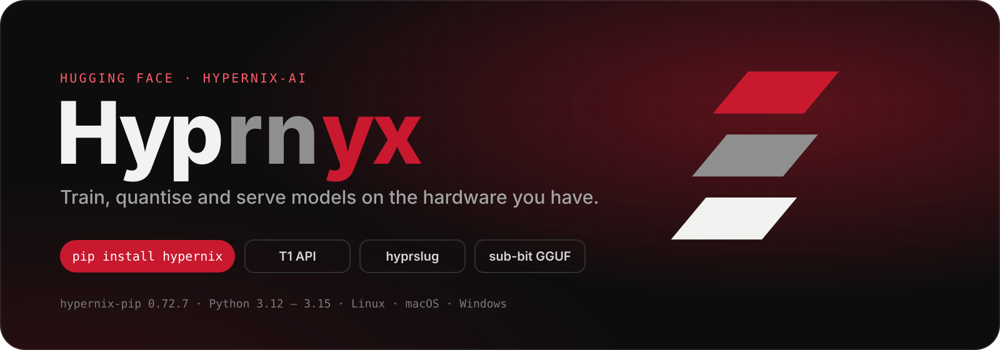

<p align="center">
  
</p>

<p align="center">
  <a href="https://pypi.org/project/hypernix/"></a>
  <a href="https://github.com/trail-b1az3r/HyperNix-pip"></a>
  <a href="https://trail-b1az3r.github.io/HyperNix-pip/"></a>
</p>

<p align="center">
  <b>👋 Hi, we're Hyprnyx.</b> We build <a href="https://github.com/trail-b1az3r/HyperNix-pip"><code>hypernix-pip</code></a>, the end-to-end toolkit for training, quantising and serving AI models — on new hardware and on old.
</p>

---

## What we build

<table>
  <tr>
    <td width="33%" valign="top">
      <h3>🔥 Train</h3>
      VRAM managers, Abbicus curricula, STML context folding and Pressure Cooker V5 with QAT — tuned so a GTX&nbsp;1080 still finishes the run.<br/><br/>
      <code>hypernix train run</code> · <code>brew</code> · <code>fusebox</code>
    </td>
    <td width="33%" valign="top">
      <h3>🔺 Quantise</h3>
      Every llama.cpp type, HyperNix hybrids and sub-bit tiers down to <code>IQ0.25</code>, plus multi-quant bundles and embedded drafts. No llama.cpp binary needed.<br/><br/>
      <code>hyprslug</code> · <code>steamroller</code> · <code>dflash2</code>
    </td>
    <td width="33%" valign="top">
      <h3>🛰️ Serve</h3>
      The T1 API server with a built-in runner, daily-rotating v2.1 keys, conceal mode and HyperLink for your phone — managed from anywhere with <code>waiter</code>.<br/><br/>
      <code>hypernix-t1</code> · <code>waiter</code> · <code>gkey</code>
    </td>
  </tr>
</table>

```bash
pip install hypernix
hypernix all --repo-id hyper-nix.1 --quants fp16 q4_k_m   # download → GGUF
hyprslug model.f16.gguf IQ0.5_XXXL                        # sub-bit, no llama.cpp
hypernix-t1 create && hypernix-t1 start                   # your own API server
```

---

## Models

The HyperNix family, trained with the toolkit it ships with. Published under [ray0rf1re](https://huggingface.co/ray0rf1re) for now.

| Model | What it is |
|---|---|
| [**HyperNix.3-mini**](https://huggingface.co/ray0rf1re/HyperNix.3-mini) | The newest; the default the T1 built-in runner serves |
| [**hyper-Nix.2**](https://huggingface.co/ray0rf1re/hyper-Nix.2) | Second-generation HyperNix |
| [**hyper-nix.1**](https://huggingface.co/ray0rf1re/hyper-nix.1) | Where it started: the model hypernix-pip was written to convert |
| [**Nano-Nano v5.1**](https://huggingface.co/ray0rf1re/Nano-Nano_v5.1) | The nano series: tiny, fast, CPU-friendly |
| [**Nano-mini 6.99 v2**](https://huggingface.co/ray0rf1re/Nano-mini-6.99-v2) | Nano's bigger sibling |

---

## Principles

**Old hardware is real hardware.** A Pascal card, an 8 GB GPU, an Intel Mac on torch 1.13. If a feature only works on the newest GPU, it isn't finished.

**Measure, then say it.** Parameter counts come from the tensor table, not the filename. When a setting costs throughput, the tool prints how much.

**Safe by default.** Checkpoints are never unpickled, keys stay in the key store, downloaded code is never executed.

---

<p align="center">
  <a href="https://huggingface.co/spaces/hypernix-ai/README">Open the full page →</a><br/>
  <sub>Hyprnyx · hypernix-ai · hypernix-pip is released under the HOS / LLU licence</sub>
</p>
